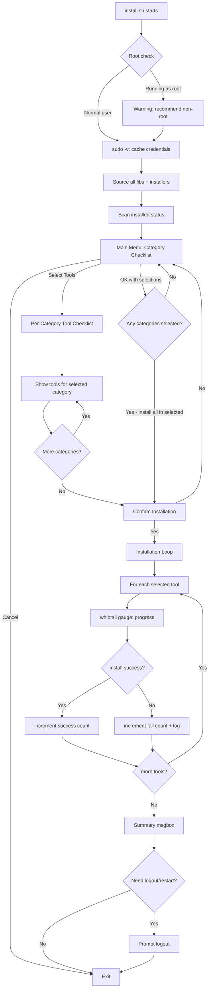
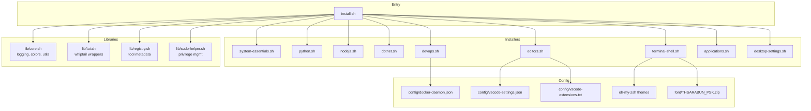
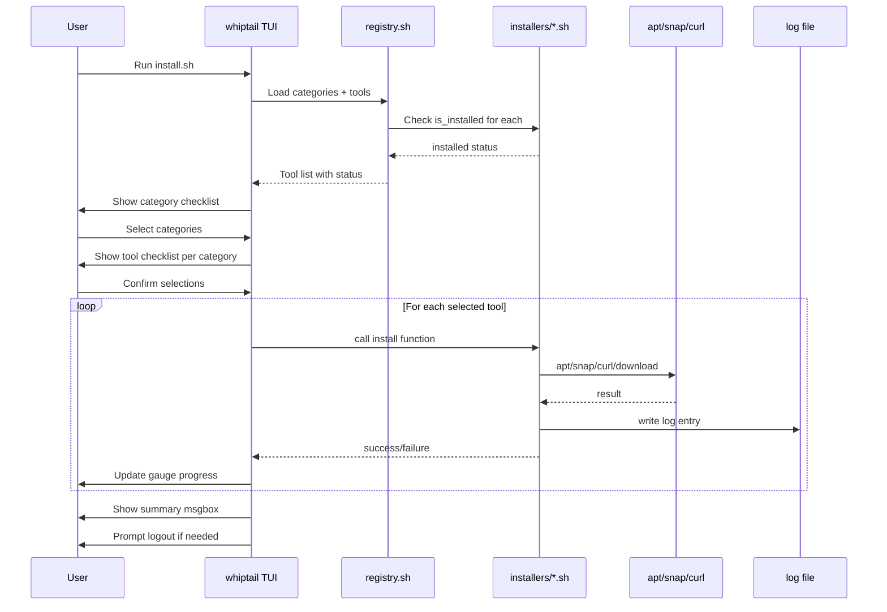

# 🏗️ Architecture: Dev Tool Installer — Ubuntu Desktop

> **Version:** 1.0.0  
> **Tech Stack:** Shell Script (.sh) + whiptail TUI  
> **Target OS:** Ubuntu Desktop 22.04+ / 24.04+  
> **Reference:** dev-tool-installer-windows (C# .NET 10 + AOT)

---

## 1. สรุปภาพรวม

Dev Tool Installer Ubuntu เป็น shell script TUI application สำหรับตั้งค่า Development Environment บน Ubuntu Desktop อัตโนมัติ ออกแบบให้ mapping 1:1 กับเวอร์ชัน Windows โดยใช้ Linux-native tools

### หลักการออกแบบ

- **Zero Dependencies** — ใช้เฉพาะ tools ที่มีอยู่ใน Ubuntu แล้ว (bash, whiptail, apt)
- **Modular** — แต่ละ installer เป็น sourced script แยกไฟล์ตาม category
- **Idempotent** — รันซ้ำได้โดยไม่พัง ตรวจสอบก่อนติดตั้งทุกครั้ง
- **Interface Pattern** — ทุก tool ต้อง implement functions: `is_installed`, `install`, `description`
- **Two-Level TUI** — Category selection → Tool selection → Install → Summary

---

## 2. Project Directory Structure

```
dev-tool-installer-ubuntu/
├── install.sh                          # Main entry point — TUI + orchestration
├── lib/
│   ├── core.sh                         # Core utilities: logging, colors, paths
│   ├── tui.sh                          # whiptail wrapper functions
│   ├── registry.sh                     # Tool registry: categories, tool metadata
│   └── sudo-helper.sh                  # Privilege management: sudo caching
├── installers/
│   ├── system-essentials.sh            # build-essential, curl, wget, git, etc.
│   ├── python.sh                       # python3, pip, venv, poetry, uv
│   ├── nodejs.sh                       # nvm, node 20, npm, pnpm, nodemon, ts
│   ├── dotnet.sh                       # dotnet-sdk-10.0
│   ├── devops.sh                       # docker-ce, docker-compose, pgvector
│   ├── editors.sh                      # VS Code + extensions + settings
│   ├── terminal-shell.sh              # oh-my-zsh, fonts, GNOME Terminal, profiles
│   ├── applications.sh                 # Postman, RustDesk, WireGuard, browsers
│   └── desktop-settings.sh            # GNOME settings, browser policies
├── config/
│   ├── .gitkeep                       # (paradox.omp.json removed — Oh My Zsh uses ~/.oh-my-zsh themes)
│   ├── vscode-settings.json           # VS Code user settings template
│   ├── vscode-extensions.txt          # VS Code extensions list (1 per line)
│   ├── vscode-extensions-uninstall.txt # Extensions to remove
│   └── docker-daemon.json             # Docker daemon config template
├── font/
│   └── THSARABUN_PSK.zip             # Bundled TH Sarabun PSK font
├── context/
│   ├── INDEX.md
│   └── dev-tool-installer-ubuntu/
│       ├── INDEX.md
│       ├── architecture.md            # This document
│       └── journal/
├── plans/                              # Planning documents
├── .gitignore
└── README.md
```

### สำคัญ: ไฟล์หลัก

| ไฟล์ | หน้าที่ |
|------|---------|
| `install.sh` | Entry point — source libs, แสดง TUI, orchestrate installation |
| `lib/core.sh` | Logging, color output, path helpers, OS detection |
| `lib/tui.sh` | whiptail wrappers: checklist, gauge, msgbox, yesno |
| `lib/registry.sh` | Define categories + tools metadata array |
| `lib/sudo-helper.sh` | sudo credential caching + privilege checks |
| `installers/*.sh` | แต่ละไฟล์ = 1 category, มีหลาย tool functions |

---

## 3. Module System Design

### 3.1 Interface Pattern

ทุก tool ต้อง implement 3 functions ตาม naming convention:

```bash
# Naming convention: <category>__<tool>__<function>
# Double underscore เพื่อแยก category กับ tool ชัดเจน

# ตัวอย่าง: Python > Poetry
python__poetry__description() {
    echo "Python dependency management and packaging tool"
}

python__poetry__is_installed() {
    command -v poetry &>/dev/null
    return $?
}

python__poetry__install() {
    log_info "Installing Poetry via pipx..."
    pipx install poetry 2>&1 | tee -a "$LOG_FILE"
    return $?
}
```

### 3.2 Registry System

`lib/registry.sh` เก็บ metadata ของทุก tool ใน associative arrays:

```bash
# Category definitions
declare -a CATEGORIES=(
    "system_essentials:System Essentials:Essential build tools and utilities"
    "python:Python Development:Python runtime and package managers"
    "nodejs:Node.js Development:Node.js runtime and JavaScript tools"
    "dotnet:.NET Development:.NET SDK for C# development"
    "devops:DevOps Tools:Container and orchestration tools"
    "editors:Editors and IDEs:Code editors with extensions"
    "terminal_shell:Terminal and Shell:Shell customization and fonts"
    "applications:Applications:Developer applications and browsers"
    "desktop_settings:Desktop Settings:GNOME desktop preferences"
)

# Tool definitions: "category:tool_id:display_name:always_run"
declare -a TOOLS=(
    "system_essentials:build_essential:build-essential:false"
    "system_essentials:curl:curl:false"
    "system_essentials:wget:wget:false"
    "system_essentials:git:Git:false"
    "system_essentials:software_properties:software-properties-common:false"
    "system_essentials:ca_certificates:ca-certificates:false"
    "system_essentials:gnupg:gnupg:false"
    "system_essentials:unzip:unzip:false"
    "system_essentials:jq:jq:false"
    "python:python3:Python 3:false"
    "python:python3_pip:python3-pip:false"
    "python:python3_venv:python3-venv:false"
    "python:poetry:Poetry:false"
    "python:uv:uv:false"
    "nodejs:nvm:NVM:false"
    "nodejs:node20:Node.js 20 LTS:false"
    "nodejs:npm:npm:false"
    "nodejs:nodejs_tools:Node.js Dev Tools:false"
    "dotnet:dotnet_sdk:NET 10 SDK:false"
    "devops:docker_ce:Docker CE:false"
    "devops:docker_compose:Docker Compose:false"
    "devops:docker_pgvector:pgvector Image:false"
    "editors:vscode:Visual Studio Code:false"
    "editors:vscode_extensions:VS Code Extensions:true"
    "editors:vscode_settings:VS Code Settings:true"
    "terminal_shell:oh_my_zsh:Oh My Zsh:false"
    "terminal_shell:font_cascadia:CascadiaMono Nerd Font:true"
    "terminal_shell:font_thsarabun:TH Sarabun PSK:true"
    "terminal_shell:gnome_terminal:GNOME Terminal Config:true"
    "terminal_shell:shell_profile:Shell Profile:true"
    "applications:postman:Postman:false"
    "applications:rustdesk:RustDesk:false"
    "applications:wireguard:WireGuard:false"
    "applications:chrome:Google Chrome:false"
    "applications:firefox:Firefox:false"
    "applications:brave:Brave Browser:false"
    "applications:opera:Opera Browser:false"
    "desktop_settings:gnome_settings:GNOME Desktop Settings:true"
    "desktop_settings:browser_policies:Browser Privacy Policies:true"
)
```

### 3.3 Dynamic Tool Discovery

`registry.sh` จะ source ทุก installer file แล้วสร้าง function map อัตโนมัติ:

```bash
source_all_installers() {
    local installer_dir="$(dirname "$0")/installers"
    for f in "$installer_dir"/*.sh; do
        source "$f"
    done
}

# Generic wrapper: เรียก function ตาม naming convention
tool_is_installed() {
    local category="$1" tool="$2"
    local func="${category}__${tool}__is_installed"
    if declare -f "$func" &>/dev/null; then
        "$func"
        return $?
    fi
    return 1  # function not found = not installed
}

tool_install() {
    local category="$1" tool="$2"
    local func="${category}__${tool}__install"
    if declare -f "$func" &>/dev/null; then
        "$func"
        return $?
    fi
    log_error "Install function not found: $func"
    return 1
}
```

---

## 4. Tool Mapping: Windows → Ubuntu

### 4.1 Complete Mapping Table

| # | Windows Tool | Ubuntu Tool | Category | Install Method | Detection |
|---|-------------|-------------|----------|---------------|-----------|
| 1 | — (new) | build-essential | System Essentials | apt | `dpkg -l build-essential` |
| 2 | — (new) | curl | System Essentials | apt | `command -v curl` |
| 3 | — (new) | wget | System Essentials | apt | `command -v wget` |
| 4 | Git | git | System Essentials | apt | `command -v git` |
| 5 | — (new) | software-properties-common | System Essentials | apt | `dpkg -l software-properties-common` |
| 6 | — (new) | ca-certificates | System Essentials | apt | `dpkg -l ca-certificates` |
| 7 | — (new) | gnupg | System Essentials | apt | `command -v gpg` |
| 8 | — (new) | unzip | System Essentials | apt | `command -v unzip` |
| 9 | — (new) | jq | System Essentials | apt | `command -v jq` |
| 10 | Python 3.12.5 | python3 | Python | apt | `command -v python3` |
| 11 | pip | python3-pip | Python | apt | `python3 -m pip --version` |
| 12 | VC++ Build Tools | python3-venv | Python | apt | `dpkg -l python3-venv` |
| 13 | Poetry | poetry | Python | pipx / curl | `command -v poetry` |
| 14 | uv | uv | Python | curl script | `command -v uv` |
| 15 | NVM for Windows | nvm (nvm-sh) | Node.js | curl script | `[ -d "$NVM_DIR" ]` |
| 16 | Node.js 20 | node 20 | Node.js | nvm install | `node --version` |
| 17 | npm | npm | Node.js | comes with node | `command -v npm` |
| 18 | Node.js Dev Tools | pnpm, nodemon, typescript | Node.js | npm -g install | `command -v pnpm` |
| 19 | .NET 10 SDK | dotnet-sdk-10.0 | .NET | Microsoft APT repo | `command -v dotnet` |
| 20 | Docker Desktop | docker-ce | DevOps | Docker APT repo | `command -v docker` |
| 21 | Docker Compose | docker-compose-plugin | DevOps | Docker APT repo | `docker compose version` |
| 22 | pgvector image | pgvector/pgvector:pg17 | DevOps | docker pull | `docker images \| grep pgvector` |
| 23 | VS Code | code | Editors | Microsoft APT repo | `command -v code` |
| 24 | 31 Extensions | same extensions | Editors | code --install-extension | `code --list-extensions` |
| 25 | VS Code Settings | settings.json | Editors | config file copy/merge | file existence check |
| 26 | Oh My Zsh | oh-my-zsh | Terminal | oh-my-zsh install script | `[ -d "$HOME/.oh-my-zsh" ]` |
| 27 | CascadiaMono NF | CascadiaMono NF | Terminal | download + fc-cache | `fc-list \| grep CaskaydiaMono` |
| 28 | TH Sarabun | TH Sarabun PSK | Terminal | bundled zip + fc-cache | `fc-list \| grep Sarabun` |
| 29 | Windows Terminal config | GNOME Terminal config | Terminal | gsettings/dconf | always run |
| 30 | PowerShell profile | .zshrc (oh-my-zsh config) | Terminal | shell config append | always run |
| 31 | Postman | Postman | Applications | snap | `snap list postman` |
| 32 | RustDesk | RustDesk | Applications | .deb download | `command -v rustdesk` |
| 33 | WireGuard | wireguard | Applications | apt | `command -v wg` |
| 34 | Chrome | google-chrome-stable | Applications | .deb from Google | `command -v google-chrome-stable` |
| 35 | Firefox | firefox | Applications | apt (pre-installed) | `command -v firefox` |
| 36 | Brave | brave-browser | Applications | Brave APT repo | `command -v brave-browser` |
| 37 | Opera | opera-stable | Applications | Opera APT repo | `command -v opera` |
| 38 | Explorer Settings | GNOME Settings | Desktop | gsettings | always run |
| 39 | Browser Settings | Browser Policies | Desktop | JSON policy files | always run |

### 4.2 Skipped Tools (ไม่มีบน Linux หรือไม่จำเป็น)

| Windows Tool | เหตุผล |
|-------------|--------|
| Notepad++ | ไม่มี Linux version; ใช้ VS Code แทน |
| Windows Terminal | ไม่จำเป็น; ใช้ GNOME Terminal |
| PowerShell 7 | ไม่จำเป็นบน Linux; ใช้ bash/zsh |
| WSL2 config | ไม่จำเป็น; อยู่บน Linux อยู่แล้ว |
| VC++ Build Tools | แทนที่ด้วย build-essential + python3-venv |

---

## 5. TUI Flow Design (whiptail)

### 5.1 Flow Diagram



### 5.2 Screen Designs

#### Screen 1: Main Menu — Category Selection

```
┌──────────── Dev Tool Installer v1.0 ─────────────┐
│                                                    │
│  Select categories to install:                     │
│                                                    │
│  [*] System Essentials        9 tools  (2 new)    │
│  [*] Python Development       5 tools  (3 new)    │
│  [*] Node.js Development      4 tools  (4 new)    │
│  [ ] .NET Development         1 tool   (1 new)    │
│  [*] DevOps Tools             3 tools  (3 new)    │
│  [*] Editors and IDEs         3 items  (1 new)    │
│  [*] Terminal and Shell       5 items  (0 new)    │
│  [*] Applications             7 tools  (5 new)    │
│  [ ] Desktop Settings         2 items  (0 new)    │
│                                                    │
│       <OK>    <Select Tools>    <Cancel>           │
└────────────────────────────────────────────────────┘
```

**ปุ่ม:**
- **OK** → ติดตั้งทุก tool ใน category ที่เลือก (ข้าม already installed ยกเว้น always_run)
- **Select Tools** → เข้า per-category tool checklist
- **Cancel** → ออก

#### Screen 2: Per-Category Tool Selection

```
┌──────── Python Development ──────────────────────┐
│                                                    │
│  Select tools to install:                          │
│                                                    │
│  [*] Python 3               ✓ installed            │
│  [*] python3-pip            ✓ installed            │
│  [*] python3-venv           ✗ not installed         │
│  [*] Poetry                 ✗ not installed         │
│  [*] uv                    ✗ not installed         │
│                                                    │
│              <OK>        <Cancel>                  │
└────────────────────────────────────────────────────┘
```

#### Screen 3: Installation Progress

```
┌──────── Installing... ───────────────────────────┐
│                                                    │
│  [3/12] Installing Poetry...                       │
│                                                    │
│  ████████████████████░░░░░░░░░░  65%              │
│                                                    │
└────────────────────────────────────────────────────┘
```

ใช้ `whiptail --gauge` สำหรับ progress bar

#### Screen 4: Installation Summary

```
┌──────── Installation Summary ────────────────────┐
│                                                    │
│  ✓ Succeeded: 10                                   │
│  ✗ Failed:    2                                    │
│  ~ Skipped:   3  (already installed)              │
│  ─────────────────                                │
│  Total:       15                                   │
│                                                    │
│  Log file: /tmp/dev-tool-installer-20260331.log   │
│                                                    │
│                    <OK>                            │
└────────────────────────────────────────────────────┘
```

#### Screen 5: Logout Prompt

```
┌──────── Session Restart ─────────────────────────┐
│                                                    │
│  Some changes require logout to take effect:       │
│  - Docker group membership                         │
│  - Font changes                                    │
│  - PATH updates                                    │
│                                                    │
│  Log out now?                                      │
│                                                    │
│              <Yes>        <No>                     │
└────────────────────────────────────────────────────┘
```

### 5.3 whiptail Implementation Strategy

| Widget | Usage | whiptail Command |
|--------|-------|-----------------|
| checklist | Category/tool selection | `whiptail --checklist` |
| gauge | Installation progress | `whiptail --gauge` |
| msgbox | Summary, errors | `whiptail --msgbox` |
| yesno | Confirmation dialogs | `whiptail --yesno` |
| menu | Optional: action selection | `whiptail --menu` |
| infobox | Quick status messages | `whiptail --infobox` |

**Terminal size detection:**
```bash
TERM_HEIGHT=$(tput lines)
TERM_WIDTH=$(tput cols)
DIALOG_HEIGHT=$((TERM_HEIGHT - 4))
DIALOG_WIDTH=$((TERM_WIDTH - 10))
```

---

## 6. Installation Patterns

### 6.1 APT Package Pattern

ส่วนใหญ่ของ tools ติดตั้งผ่าน apt:

```bash
system_essentials__git__install() {
    sudo apt-get install -y git 2>&1 | tee -a "$LOG_FILE"
    return ${PIPESTATUS[0]}
}
```

### 6.2 APT Repository Pattern

สำหรับ tools ที่ต้องเพิ่ม repo ก่อน:

```bash
editors__vscode__install() {
    # Add Microsoft GPG key
    curl -fsSL https://packages.microsoft.com/keys/microsoft.asc \
        | sudo gpg --dearmor -o /usr/share/keyrings/microsoft.gpg
    
    # Add VS Code repository
    echo "deb [arch=amd64 signed-by=/usr/share/keyrings/microsoft.gpg] \
        https://packages.microsoft.com/repos/code stable main" \
        | sudo tee /etc/apt/sources.list.d/vscode.list
    
    sudo apt-get update
    sudo apt-get install -y code
}
```

### 6.3 Snap Package Pattern

```bash
applications__postman__install() {
    sudo snap install postman
    return $?
}
```

### 6.4 Curl Script Pattern

สำหรับ tools ที่ติดตั้งผ่าน script:

```bash
nodejs__nvm__install() {
    # Install nvm
    curl -o- https://raw.githubusercontent.com/nvm-sh/nvm/v0.40.3/install.sh | bash
    
    # Source nvm immediately for current session
    export NVM_DIR="$HOME/.nvm"
    [ -s "$NVM_DIR/nvm.sh" ] && source "$NVM_DIR/nvm.sh"
    
    return $?
}
```

### 6.5 Oh My Zsh Install Pattern

```bash
terminal_shell__oh_my_zsh__install() {
    # Install Oh My Zsh (unattended)
    sh -c "$(curl -fsSL https://raw.githubusercontent.com/ohmyzsh/ohmyzsh/master/tools/install.sh)" "" --unattended
    return $?
}
```

### 6.6 DEB Download Pattern

```bash
applications__rustdesk__install() {
    local tmp_deb="/tmp/rustdesk.deb"
    curl -fsSL -o "$tmp_deb" \
        "https://github.com/rustdesk/rustdesk/releases/download/1.3.9/rustdesk-1.3.9-x86_64.deb"
    sudo dpkg -i "$tmp_deb" || sudo apt-get install -f -y
    rm -f "$tmp_deb"
    return $?
}
```

### 6.7 Configuration-Only Pattern (AlwaysRun)

```bash
editors__vscode_settings__install() {
    local settings_dir="$HOME/.config/Code/User"
    local settings_file="$settings_dir/settings.json"
    local template="$(dirname "$0")/config/vscode-settings.json"
    
    mkdir -p "$settings_dir"
    
    if [ -f "$settings_file" ]; then
        # Merge: use jq to merge template into existing
        jq -s '.[0] * .[1]' "$settings_file" "$template" > "${settings_file}.tmp"
        mv "${settings_file}.tmp" "$settings_file"
    else
        cp "$template" "$settings_file"
    fi
    
    return 0
}
```

---

## 7. Detailed Installation Strategy Per Tool

### 7.1 System Essentials

| Tool | Primary | Fallback | Detection | Post-Config |
|------|---------|----------|-----------|-------------|
| build-essential | `apt install` | — | `dpkg -l build-essential` | — |
| curl | `apt install` | — | `command -v curl` | — |
| wget | `apt install` | — | `command -v wget` | — |
| git | `apt install` | PPA git-core | `command -v git` | git config user.name/email prompt |
| software-properties-common | `apt install` | — | `dpkg -l` | — |
| ca-certificates | `apt install` | — | `dpkg -l` | — |
| gnupg | `apt install` | — | `command -v gpg` | — |
| unzip | `apt install` | — | `command -v unzip` | — |
| jq | `apt install` | — | `command -v jq` | — |

### 7.2 Python Development

| Tool | Primary | Fallback | Detection | Post-Config |
|------|---------|----------|-----------|-------------|
| python3 | `apt install python3` | deadsnakes PPA | `command -v python3` | — |
| python3-pip | `apt install python3-pip` | `python3 -m ensurepip` | `python3 -m pip --version` | — |
| python3-venv | `apt install python3-venv` | — | `dpkg -l python3-venv` | — |
| Poetry | `pipx install poetry` | `curl` script | `command -v poetry` | — |
| uv | `curl -LsSf https://astral.sh/uv/install.sh \| sh` | pipx | `command -v uv` | — |

### 7.3 Node.js Development

| Tool | Primary | Fallback | Detection | Post-Config |
|------|---------|----------|-----------|-------------|
| nvm | curl install script | git clone | `[ -d "$NVM_DIR" ]` | source in .bashrc/.zshrc |
| Node.js 20 | `nvm install 20` | NodeSource repo | `node --version` grep v20 | `nvm alias default 20` |
| npm | comes with node | — | `command -v npm` | — |
| Node.js Dev Tools | `npm install -g pnpm nodemon typescript ts-node` | — | `command -v pnpm` | — |

### 7.4 .NET Development

| Tool | Primary | Fallback | Detection | Post-Config |
|------|---------|----------|-----------|-------------|
| .NET 10 SDK | Microsoft APT repo + `apt install dotnet-sdk-10.0` | dotnet-install.sh script | `dotnet --list-sdks \| grep 10.0` | — |

### 7.5 DevOps Tools

| Tool | Primary | Fallback | Detection | Post-Config |
|------|---------|----------|-----------|-------------|
| Docker CE | Docker APT repo + `apt install docker-ce docker-ce-cli containerd.io` | snap install docker | `command -v docker` | `sudo usermod -aG docker $USER` |
| Docker Compose | `apt install docker-compose-plugin` | — | `docker compose version` | — |
| pgvector image | `docker pull pgvector/pgvector:pg17` | — | `docker images \| grep pgvector` | — |

### 7.6 Editors and IDEs

| Tool | Primary | Fallback | Detection | Post-Config |
|------|---------|----------|-----------|-------------|
| VS Code | Microsoft APT repo + `apt install code` | snap install code --classic | `command -v code` | — |
| VS Code Extensions | `code --install-extension` loop | — | `code --list-extensions` | remove unwanted extensions first |
| VS Code Settings | jq merge into settings.json | cp template | file check | — |

### 7.7 Terminal and Shell

| Tool | Primary | Fallback | Detection | Post-Config |
|------|---------|----------|-----------|-------------|
| Oh My Zsh | oh-my-zsh install script | git clone | `[ -d "$HOME/.oh-my-zsh" ]` | configure .zshrc, set theme/plugins |
| CascadiaMono NF | download zip + extract to ~/.local/share/fonts + fc-cache | — | `fc-list \| grep CaskaydiaMono` | — |
| TH Sarabun PSK | extract bundled zip to ~/.local/share/fonts + fc-cache | — | `fc-list \| grep Sarabun` | — |
| GNOME Terminal | gsettings set | dconf write | always run | font, color scheme |
| Shell Profile | append to .zshrc | — | always run | oh-my-zsh config, nvm source |

### 7.8 Applications

| Tool | Primary | Fallback | Detection | Post-Config |
|------|---------|----------|-----------|-------------|
| Postman | `snap install postman` | flatpak | `snap list postman` | — |
| RustDesk | .deb download + dpkg | — | `command -v rustdesk` | — |
| WireGuard | `apt install wireguard` | — | `command -v wg` | — |
| Google Chrome | .deb from dl.google.com + dpkg | — | `command -v google-chrome-stable` | — |
| Firefox | `apt install firefox` (pre-installed) | snap | `command -v firefox` | — |
| Brave | Brave APT repo + `apt install brave-browser` | — | `command -v brave-browser` | — |
| Opera | Opera APT repo + `apt install opera-stable` | — | `command -v opera` | — |

### 7.9 Desktop Settings

| Tool | Primary | Fallback | Detection | Post-Config |
|------|---------|----------|-----------|-------------|
| GNOME Settings | gsettings commands | dconf write | always run | show hidden files, sort folders first |
| Browser Policies | write JSON to /etc/opt/chrome/policies | — | always run | disable telemetry, set homepage |

---

## 8. Error Handling Strategy

### 8.1 Script-Level

```bash
#!/usr/bin/env bash
set -euo pipefail

# Trap for cleanup on exit
trap cleanup EXIT
trap 'error_handler $LINENO' ERR

cleanup() {
    # Remove temp files
    rm -rf "$TEMP_DIR" 2>/dev/null || true
    # Reset terminal if whiptail crashed
    reset 2>/dev/null || true
}

error_handler() {
    local line="$1"
    log_error "Error on line $line"
}
```

### 8.2 Per-Tool Error Isolation

แต่ละ tool install ถูก wrap ใน subshell เพื่อป้องกัน error propagation:

```bash
install_tool() {
    local category="$1" tool="$2"
    local result=0
    
    # Run install in isolated context
    (
        set +e  # Allow failures within tool install
        tool_install "$category" "$tool"
        exit $?
    )
    result=$?
    
    if [ $result -eq 0 ]; then
        log_success "Installed: $tool"
        return 0
    else
        log_error "Failed: $tool (exit code: $result)"
        return 1
    fi
}
```

### 8.3 Retry Pattern

สำหรับ network operations:

```bash
download_with_retry() {
    local url="$1" dest="$2" max_retries=3
    local attempt=1
    
    while [ $attempt -le $max_retries ]; do
        if curl -fsSL -o "$dest" "$url"; then
            return 0
        fi
        log_warn "Download failed (attempt $attempt/$max_retries)"
        attempt=$((attempt + 1))
        sleep 2
    done
    
    return 1
}
```

### 8.4 Dependency Resolution

```bash
# Check dependencies before install
check_dependencies() {
    local category="$1" tool="$2"
    
    case "${category}__${tool}" in
        nodejs__node20)
            if ! tool_is_installed "nodejs" "nvm"; then
                log_warn "Node.js 20 requires NVM. Installing NVM first..."
                tool_install "nodejs" "nvm" || return 1
            fi
            ;;
        devops__docker_pgvector)
            if ! tool_is_installed "devops" "docker_ce"; then
                log_warn "pgvector requires Docker. Installing Docker first..."
                tool_install "devops" "docker_ce" || return 1
            fi
            ;;
    esac
}
```

---

## 9. Logging Strategy

### 9.1 Log File

```bash
LOG_DIR="/tmp"
LOG_FILE="${LOG_DIR}/dev-tool-installer-$(date +%Y%m%d-%H%M%S).log"

# Logging functions
log_info()    { echo "[INFO]    $(date +%H:%M:%S) $*" | tee -a "$LOG_FILE"; }
log_success() { echo "[SUCCESS] $(date +%H:%M:%S) $*" | tee -a "$LOG_FILE"; }
log_warn()    { echo "[WARN]    $(date +%H:%M:%S) $*" | tee -a "$LOG_FILE"; }
log_error()   { echo "[ERROR]   $(date +%H:%M:%S) $*" | tee -a "$LOG_FILE" >&2; }
log_debug()   { echo "[DEBUG]   $(date +%H:%M:%S) $*" >> "$LOG_FILE"; }
```

### 9.2 Log Format

```
[INFO]    17:20:00 Starting Dev Tool Installer v1.0
[INFO]    17:20:01 OS: Ubuntu 24.04 LTS
[INFO]    17:20:01 User: developer
[INFO]    17:20:02 Scanning installed tools...
[INFO]    17:20:03 Found 12/39 tools already installed
[INFO]    17:20:15 --- Installation Started ---
[INFO]    17:20:15 [1/15] Installing python3-venv...
[SUCCESS] 17:20:18 Installed: python3-venv
[INFO]    17:20:18 [2/15] Installing Poetry...
[WARN]    17:20:25 Poetry: pipx not found, using curl fallback
[SUCCESS] 17:20:30 Installed: Poetry
[ERROR]   17:20:45 Failed: RustDesk (exit code: 1)
[INFO]    17:21:00 --- Installation Summary ---
[INFO]    17:21:00 Succeeded: 13 | Failed: 1 | Skipped: 1
```

### 9.3 Output Handling

ระหว่างติดตั้ง output ของ apt/curl จะถูก redirect ไป log file ไม่แสดงบน TUI:

```bash
# Redirect verbose output to log, show only progress in TUI
sudo apt-get install -y "$pkg" >> "$LOG_FILE" 2>&1
```

---

## 10. Privilege Management

### 10.1 sudo Caching

```bash
# At start of script
ensure_sudo() {
    if [ "$EUID" -eq 0 ]; then
        log_warn "Running as root. Recommend running as normal user (sudo will be used when needed)"
        return 0
    fi
    
    # Prompt for sudo password once
    sudo -v || {
        log_error "sudo authentication failed"
        exit 1
    }
    
    # Keep sudo alive in background
    while true; do
        sudo -n true
        sleep 50
        kill -0 "$$" || exit
    done 2>/dev/null &
    SUDO_KEEPALIVE_PID=$!
}
```

### 10.2 Operations ที่ต้อง sudo

| Operation | ต้อง sudo | เหตุผล |
|-----------|----------|--------|
| apt-get install | ✓ | system package install |
| snap install | ✓ | system snap |
| add APT repo | ✓ | write to /etc/apt |
| dpkg -i | ✓ | system package install |
| usermod -aG docker | ✓ | modify user groups |
| write to /etc | ✓ | system config |
| fc-cache (system) | ✓ | if fonts in /usr/share/fonts |

### 10.3 Operations ที่ไม่ต้อง sudo

| Operation | เหตุผล |
|-----------|--------|
| nvm install | user-space (~/.nvm) |
| npm install -g | user-space via nvm |
| oh-my-zsh install | user-space (~/.oh-my-zsh) |
| VS Code extensions | user-space |
| Font install to ~/.local | user home directory |
| .bashrc/.zshrc edit | user home directory |
| gsettings | user dconf database |

---

## 11. Configuration Management

### 11.1 Config Files ที่ต้อง Deploy

| File | Source | Destination | Merge Strategy |
|------|--------|-------------|---------------|
| — (oh-my-zsh) | oh-my-zsh manages themes via `~/.oh-my-zsh/themes/` | `~/.zshrc` (ZSH_THEME setting) | oh-my-zsh built-in |
| `config/vscode-settings.json` | bundled | `~/.config/Code/User/settings.json` | jq merge (keep existing) |
| `config/vscode-extensions.txt` | bundled | — (used as input list) | — |
| `config/docker-daemon.json` | bundled | `/etc/docker/daemon.json` | jq merge (sudo) |
| `font/THSARABUN_PSK.zip` | bundled | `~/.local/share/fonts/` | extract |

### 11.2 VS Code Settings (Linux-specific adjustments)

```json
{
    "terminal.integrated.defaultProfile.linux": "bash",
    "terminal.integrated.fontFamily": "CaskaydiaMono Nerd Font",
    "editor.fontFamily": "'CaskaydiaMono Nerd Font', 'Droid Sans Mono', monospace"
}
```

### 11.3 Shell Profile Content

```bash
# === Dev Tool Installer Configuration ===
# Oh My Zsh is configured via ~/.zshrc (managed by oh-my-zsh itself)
# ZSH_THEME="robbyrussell"
# plugins=(git docker nvm)

# NVM
export NVM_DIR="$HOME/.nvm"
[ -s "$NVM_DIR/nvm.sh" ] && source "$NVM_DIR/nvm.sh"
[ -s "$NVM_DIR/bash_completion" ] && source "$NVM_DIR/bash_completion"

# uv
[ -s "$HOME/.local/bin/env" ] && source "$HOME/.local/bin/env"

# .NET
export DOTNET_ROOT="$HOME/.dotnet"
export PATH="$PATH:$DOTNET_ROOT:$DOTNET_ROOT/tools"
# === End Dev Tool Installer Configuration ===
```

Profile editing strategy: ใช้ marker comments เพื่อ idempotent update:

```bash
update_shell_profile() {
    local profile="$1"
    local marker_start="# === Dev Tool Installer Configuration ==="
    local marker_end="# === End Dev Tool Installer Configuration ==="
    
    # Remove old block if exists
    if grep -q "$marker_start" "$profile" 2>/dev/null; then
        sed -i "/$marker_start/,/$marker_end/d" "$profile"
    fi
    
    # Append new block
    cat >> "$profile" << 'PROFILE_BLOCK'
# === Dev Tool Installer Configuration ===
...
# === End Dev Tool Installer Configuration ===
PROFILE_BLOCK
}
```

### 11.4 GNOME Desktop Settings

```bash
desktop_settings__gnome_settings__install() {
    # Show hidden files in Files (Nautilus)
    gsettings set org.gnome.nautilus.preferences show-hidden-files true
    
    # Sort folders before files
    gsettings set org.gtk.gtk4.Settings.FileChooser sort-directories-first true
    gsettings set org.gtk.Settings.FileChooser sort-directories-first true
    
    # Show file extensions
    # (Nautilus shows extensions by default on Linux)
    
    # Dark theme
    gsettings set org.gnome.desktop.interface color-scheme 'prefer-dark'
    
    # Minimize/Maximize buttons
    gsettings set org.gnome.desktop.wm.preferences button-layout ':minimize,maximize,close'
}
```

---

## 12. Idempotency Guarantees

| Pattern | Implementation |
|---------|---------------|
| Package install | `dpkg -l` or `command -v` check before install |
| APT repo add | Check if repo file exists before adding |
| Config merge | jq merge preserves existing keys |
| Shell profile | Marker-based block replacement |
| Font install | fc-list check before download |
| Docker group | `groups \| grep docker` check |
| VS Code extensions | `code --list-extensions` check |

---

## 13. Architecture Diagrams

### 13.1 Component Architecture



### 13.2 Install Flow Sequence



---

## 14. Windows vs Ubuntu Architecture Comparison

| Aspect | Windows (C# .NET) | Ubuntu (Shell Script) |
|--------|-------------------|----------------------|
| Language | C# 10 / .NET 10 AOT | Bash 5.x |
| TUI Framework | Custom Console API | whiptail (newt) |
| Interface | IInstaller interface | Naming convention functions |
| Registry | Static List of IInstaller | Associative arrays + source |
| Package Manager | winget / direct download | apt / snap / curl |
| Privilege | Run as Administrator | sudo caching |
| Config Format | C# objects / JSON | JSON + shell variables |
| Async | async/await | Sequential (background jobs for sudo) |
| Error Handling | try/catch | set -e + trap + return codes |
| Logging | ConsoleHelper | tee + log functions |
| Progress | Custom progress bar | whiptail --gauge |
| Binary Size | ~15MB AOT compiled | ~50KB scripts total |
| Dependencies | None (self-contained) | bash, whiptail, curl, jq |

---

## 15. Future Considerations

### 15.1 ขยายรองรับ Distro อื่น

```bash
detect_distro() {
    if [ -f /etc/os-release ]; then
        . /etc/os-release
        echo "$ID"  # ubuntu, debian, fedora, arch
    fi
}

# Installer can branch by distro
case "$(detect_distro)" in
    ubuntu|debian)
        sudo apt-get install -y "$pkg"
        ;;
    fedora)
        sudo dnf install -y "$pkg"
        ;;
    arch)
        sudo pacman -S --noconfirm "$pkg"
        ;;
esac
```

### 15.2 Unattended Mode

```bash
# install.sh --auto  → install all tools without TUI
# install.sh --category python,nodejs → install specific categories
# install.sh --tools git,docker_ce → install specific tools
```

### 15.3 Config File

```bash
# ~/.config/dev-tool-installer/config
# Override default selections
DEFAULT_CATEGORIES="system_essentials python nodejs editors terminal_shell"
SKIP_TOOLS="opera brave"
```

---

## 16. สรุป Tool Count

| Category | จำนวน Tools | Always Run |
|----------|------------|------------|
| System Essentials | 9 | 0 |
| Python Development | 5 | 0 |
| Node.js Development | 4 | 0 |
| .NET Development | 1 | 0 |
| DevOps Tools | 3 | 0 |
| Editors and IDEs | 3 | 2 |
| Terminal and Shell | 5 | 3 |
| Applications | 7 | 0 |
| Desktop Settings | 2 | 2 |
| **รวม** | **39** | **7** |

เทียบกับ Windows: 28 tools (ไม่นับ WSL, Notepad++, Windows Terminal, PowerShell 7 ที่ skip)  
Ubuntu version: 39 tools (เพิ่ม System Essentials 9 ตัว + แยก items ที่ Windows รวมกัน)